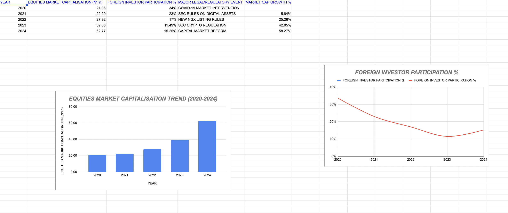

# 📊 Legal & Regulatory Impact on Foreign Investor Participation and Capital Market Development in Nigeria

## 📌 Overview

This project analyzes how legal and regulatory changes influence foreign investor participation and capital market growth in Nigeria from 2020 to 2024.

It combines financial data with key regulatory events to identify patterns in investor behavior and market performance.

---

## 🎯 Objectives

* Analyze trends in equities market capitalization
* Examine foreign investor participation over time
* Assess the impact of regulatory changes on market growth
* Identify relationships between policy actions and investor confidence

---

## 🛠️ Tools Used

* Google Sheets
* Excel
* Data Visualization (Charts)

---

## 📊 Key Insights

### 🔹 Market Growth

* Market capitalization shows strong upward growth from 2020 to 2024
* Significant acceleration observed after regulatory reforms

### 🔹 Foreign Investor Participation

* Decline observed between 2020–2023
* Slight recovery begins in 2024

### 🔹 Regulatory Impact

* COVID-19 intervention initially stabilized the market
* SEC digital asset rules and crypto regulation influenced investor sentiment
* Capital market reforms contributed to strong growth in later years

### 🔹 Overall Insight

* Regulatory actions significantly influence investor participation
* Market growth can occur even when foreign participation declines
* Strong policy direction improves long-term investor confidence

---

## 📈 Dashboard

---

## 📁 Files Included

## 📊 Data Summary

The dataset includes:
- Year (2020–2024)
- Equities Market Capitalization (₦ Trillion)
- Foreign Investor Participation (%)
- Key Legal/Regulatory Events
- Market Growth (%)

This structure enables analysis of how regulatory actions influence investor behavior and market performance.
* `legal-regulatory-analysis.xlsx` → Dataset and analysis
* `dashboard.png` → Visual dashboard

## 💡 Why This Project Matters

This project demonstrates the intersection of law, finance, and data analysis by linking regulatory decisions to real market outcomes.

It highlights how legal frameworks shape investor confidence and capital market development in emerging economies like Nigeria.
---

